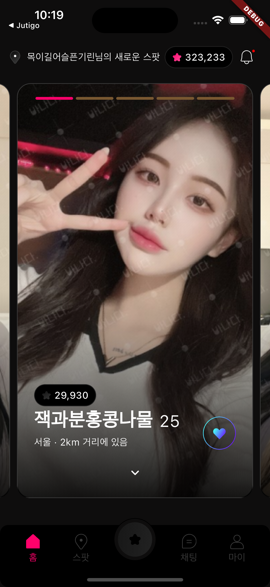
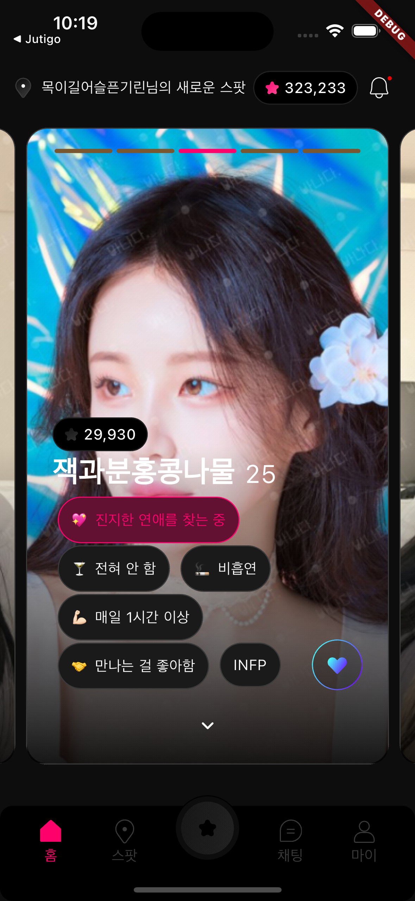
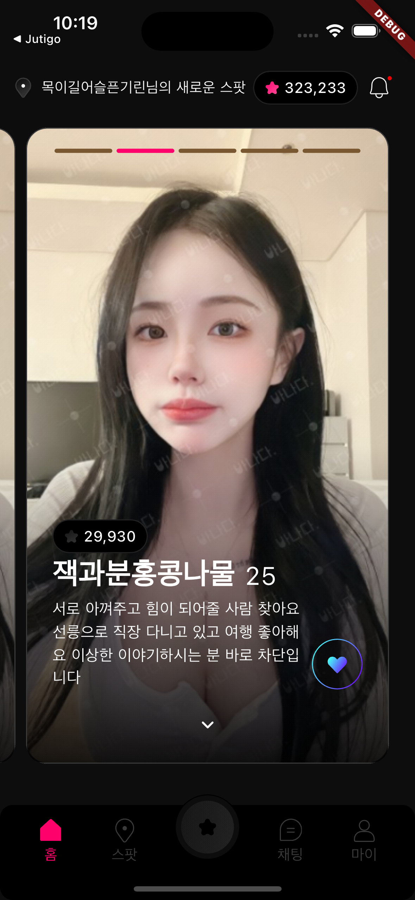
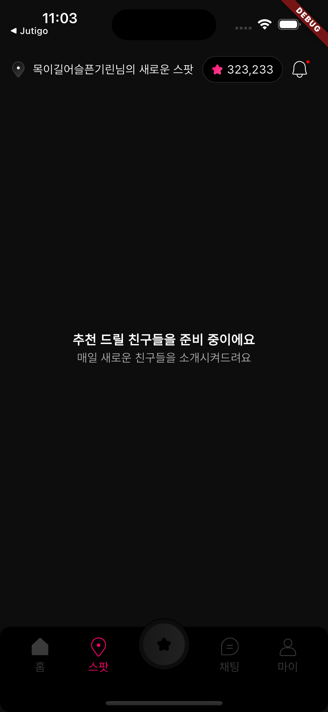

# luvit_task

This is a Flutter-based mobile application designed for assessment,
design [here](https://www.figma.com/file/mbqh9mT7QsNoPhTpeq8Slf/Luvit---Flutter-Assignment?type=design&node-id=2-1258&mode=design&t=rtqBLJNCbOzpEIeF-0)

## Screenshots

  
  
  
  

## Fonts

The font used in this app is [Pretendard](https://fontmeme.com/fonts/pretendard-font/)

## Assets

- All logos, avatars, and icons are sourced from the design.

## Note
- The app is provided as an APK file found [here](https://drive.google.com/file/d/1zT0KdzImCXvDVwTonqd8d7SE81rZ3Ima/view?usp=sharing) and the source code repository link is [here](https://github.com/Tamunorth/luvit-task).

A few resources to get you started if this is your first Flutter project:

- [Lab: Write your first Flutter app](https://docs.flutter.dev/get-started/codelab)
- [Cookbook: Useful Flutter samples](https://docs.flutter.dev/cookbook)

For help getting started with Flutter development, view the
[online documentation](https://docs.flutter.dev/), which offers tutorials,
samples, guidance on mobile development, and a full API reference.
